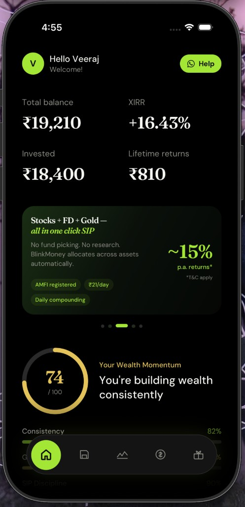
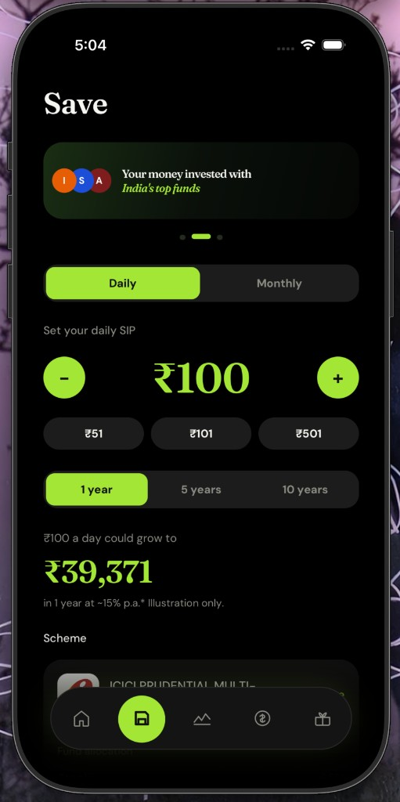
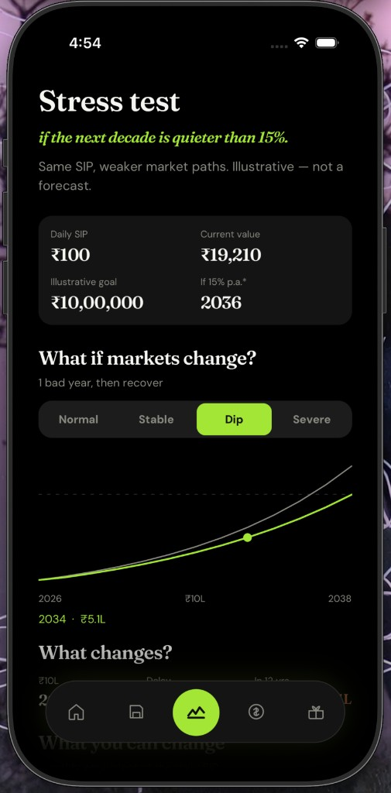
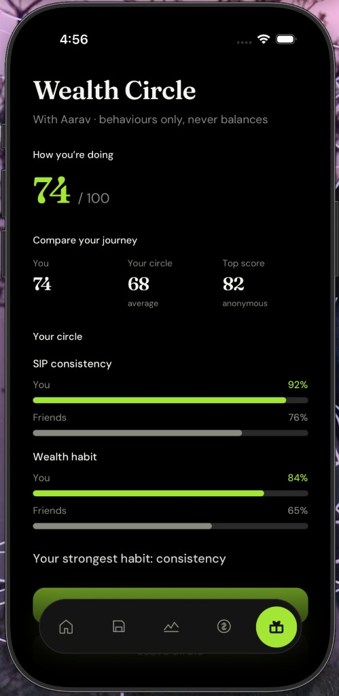

# BlinkMoney

Frontend assignment for BlinkMoney. React Native prototype of their liquid wealth account: daily SIP, stay invested, borrow without selling.

Mock data only. Nothing here is a real trade or a market forecast.

<p>
  
  &nbsp;
  
  &nbsp;
  
  &nbsp;
  
</p>

## What felt off in the live app

The product idea is simple. One account. Save, grow, borrow. Units do not get sold when you take credit.

The app I downloaded did not make that easy to see. Home felt like a marketing page. Promo cards, help, extra grids. The useful bits (today’s SIP, how close you are to unlocking credit, what a weaker decade does to the plan) were easy to miss.

I kept their colours (black and lime `#A3E635`) and the same jobs in the tabs. I did not rebuild the marketing layout. I tried to make the loop something you can actually tap through.

## Why I did not ship another portfolio screen

The brief asked for something that could move engagement, referral, or wealth gamification. It also asked for an idea that was not the first thing everyone would build.

A pie chart and two graphs would have been the obvious take. BlinkMoney is not Groww. People already have an app for “what am I holding.” What they do not have is a reason to keep the SIP running, a way to sit through a bad year without redeeming, and a way to invite a friend without posting their balance.

So I built around habits, not allocation:

- **Still Growing** (Save → Grow → Borrow) so the loop is visible
- **Wealth Momentum** plus share, so you have a reason to open the app and something small to send
- **Wealth Circle** for referral, without a coupon dump
- **Stress Test** so you can poke the plan instead of staring at a static chart

The 0–100 numbers in the app are rough plan checks. They are labelled that way. They are not NAV and not a credit score.

## Features

### Still Growing

Save, grow, and borrow on one ladder. You see the SIP, how much more invested unlocks credit, and that a draw is a lien (units stay invested).

Code: `src/components/StillGrowing.tsx` on Home. Save and Borrow are `app/(tabs)/save.tsx` and `app/(tabs)/borrow.tsx`. The calculator on Home only projects locally. It does not change the wallet behind your back.

### Wealth Momentum

One answer to “how is this going?” Consistency, growth, SIP discipline, and a next step (raise the SIP). Meant to be read in a few seconds.

Code: `src/components/WealthMomentum.tsx` on Home. Wallet state lives in `src/data/store.tsx`.

### Share progress

From Momentum, and again at the bottom of Stress Test, you can share streak and a score. Not the full portfolio. It uses the phone’s share sheet.

Stress Test card: `src/components/stress/ShareMomentumCard.tsx`.

### Wealth Circle

Referral as a pair. You add a friend and compare habits (Momentum, consistency), not rupee balances. Invite text is written that way on purpose.

Code: `src/components/WealthCircle.tsx`. Rewards tab is `app/(tabs)/rewards.tsx`. There is a short teaser on Home.

### Wealth Stress Test

Extra tab. One screen: if the next decade is quieter than the ~15% p.a.* they show, what happens to this SIP, and what can you change?

You pick a path. Normal uses their disclosed illustration. Dip and Severe are a bad year or two, then recovery, not a forever crash. The chart and the delay update in place. You can raise SIP and apply a step-up to the **simulation only**.

This was the part I did not want to be “here is another graph.” It is “here is the plan under a worse path, and the lever you actually control.”

Code: `app/(tabs)/stress.tsx` and `src/components/stress/`. Numbers come from `src/stress/calc.ts`.

## Run

**Working prototype (no login):** [https://veerajmorajkar.github.io/blinkmoneyassign/](https://veerajmorajkar.github.io/blinkmoneyassign/)

```sh
npm install
npx expo start
```

iOS simulator, Android emulator, or Expo Go. For web: `npx expo start --web`.

## Stack

Expo SDK 57, Expo Router, TypeScript, Reanimated, Gesture Handler, react-native-svg. No backend.

```
app/                   screens
src/theme.ts           colour and type
src/data/store.tsx     mock wallet
src/stress/calc.ts     scenario math
src/components/        UI
```

More on empty states and money copy: [docs/EDGE_CASES.md](./docs/EDGE_CASES.md). Visual notes: [docs/DESIGN.md](./docs/DESIGN.md).
